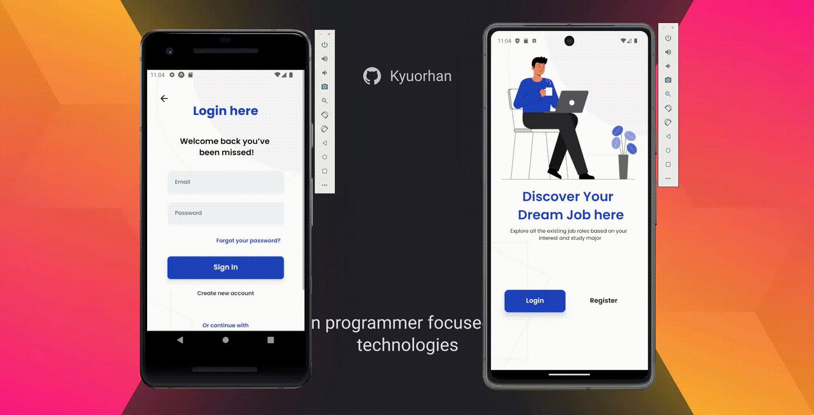

### <h3 align="center">react-native-dev-challenge</h3>
##
Confira - [Desafio Prático para Desenvolvedor  Welcome &amp; Login](https://github.com/Kyuorhan/react-native-dev-challenge/tree/master/welcome-login)

  

           
 
###

  

      
  Este projeto foi desenvolvido com ❤️ e está em constante evolução, buscando sempre novos desafios. 
  **[Sinta-se à vontade para participar e trocar ideias no GitHub! 👋](https://github.com/Kyuorhan)**.
 
  ##

  ###
  
 
     
    
     
    
    <!--  -->  
  
   

