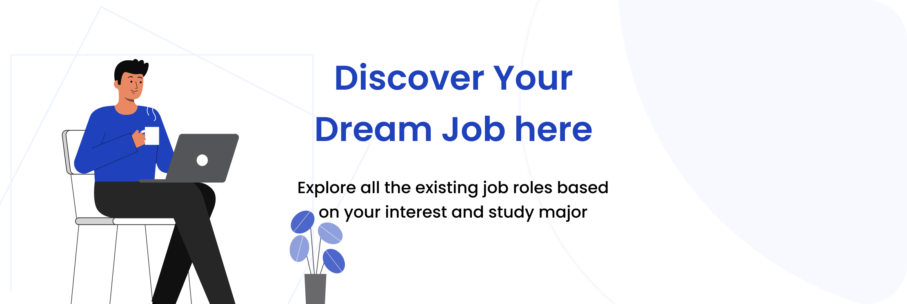

<p align="center">
    
</p>

###


### <h3 align="center">Tópicos</h3>
##

<br>

<p> 

  >- [Sobre](#sobre-) 
  >- [Layout](#layout-) 
  >- [Como Usar](#como-usar-)  
  >- [Bibliotecas](#bibliotecas-)  
</p>

###

### <h3 align="center">Sobre</h3>

##

###
   
 O projeto **Welcome & Login**, oi concebido com o objetivo de disseminar conhecimento no campo tecnológico, servindo como uma plataforma de avaliação prática das habilidades necessárias para o **Desafio Prático para Desenvolvedor Mobile - Welcome & Login**

###


### <h3 align="center">Layout</h3>
##

<p align="center">
  
</p>

<p align="center">O Layout foi desenvolvido por <a href="https://www.instagram.com/kyuorhan">Jhonny Kyuorhan</a>, e você pode acessá-lo no Figma:</p>

<br>

<p> 
    
  >- [Mobile](https://www.figma.com/file/8bXE8oDZMwkclGo75rciWa/Onboarding-(Login-%26-Register)--App-Ui-(Community)?type=design&node-id=0%3A1&mode=design&t=mxP77cr8ySn26XMw-1) 📱
</p>

<br>

###


### <h3 align="center">Demostração</h3>
##

```


```
<br>

### <h3 align="center">Como Usar</h3>
##


Clone esse **``` repositório: ```**
``` bash
git clone https://github.com/Kyuorhan/react-native-dev-challenge
```   
Entre no **``` diretório: ```**
``` bash
cd react-native-dev-challenge
```    
``` bash
cd welcome-login
```
###
> Abre seu Terminal do windows **``` start wt ```**, ou outro terminal de sua preferência.
###
Instale as **``` dependências: ```**
``` powershell 
npm install
```  
Execute a **```aplicação: ```** 
``` powershell
npx expo start
```

<br>


### <h3 align="center">Bibliotecas</h3>
##

Configuração de Navegação 
> **``` Expo Router ```** 
``` json
  "expo-router": "~3.4.8",  
```
 Estilização

> **``` Tailwind CSS ```**  & **``` StyleSheet ```** 
```json

  "dependencies": {
      "@expo-google-fonts/poppins": "^0.2.3",
      "nativewind": "^2.0.11",
      "react-native-normalize": "^1.0.1",
  }
  "devDependencies": {
      "tailwindcss": "^3.3.2",  
  }

```


###

<div align="center">
  <p></p>

  <br>  <br>
  Este projeto foi desenvolvido com ❤️ e está em constante evolução, buscando sempre novos desafios.

  ###

  **[Sinta-se à vontade para participar e trocar ideias no GitHub! 👋](https://github.com/Kyuorhan)**.
 
  ##

  ###
  <div align="center" > 
    <a href="https://www.linkedin.com/in/jhonny-kyuorhan/" target="_blank"> </a> 
    <a href = "mailto:jkdevprogrammer@gmail.com"></a>
    <a href="https://www.twitch.tv/kyuorhan" target="_blank"> </a> 
    <a href="https://www.instagram.com/kyuorhan" target="_blank"> </a>
    <!-- <a href="https://steamcommunity.com/id/Kyuorhan/" target="_blank"> </a> -->  
  </div>   
</div>
